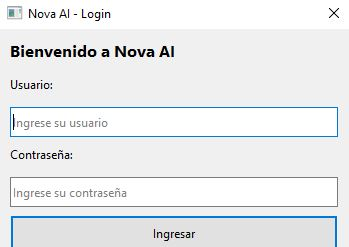
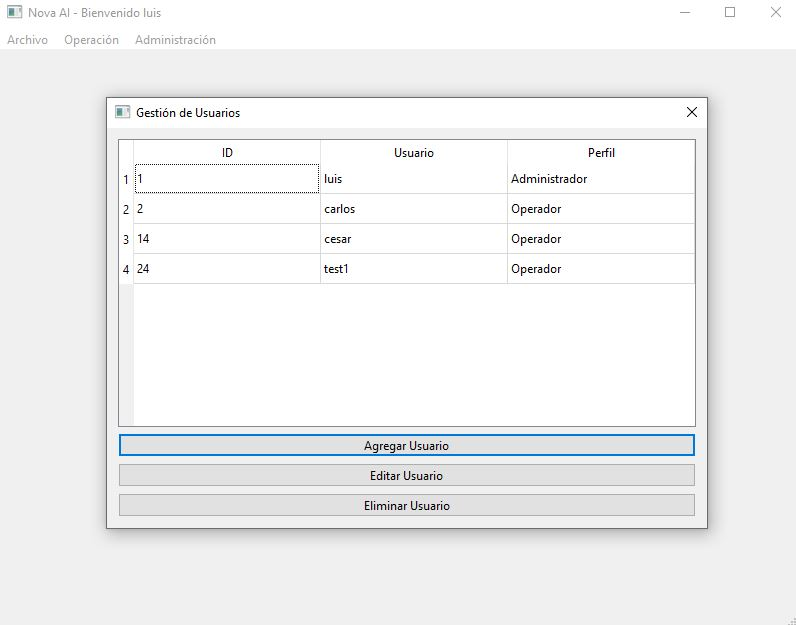
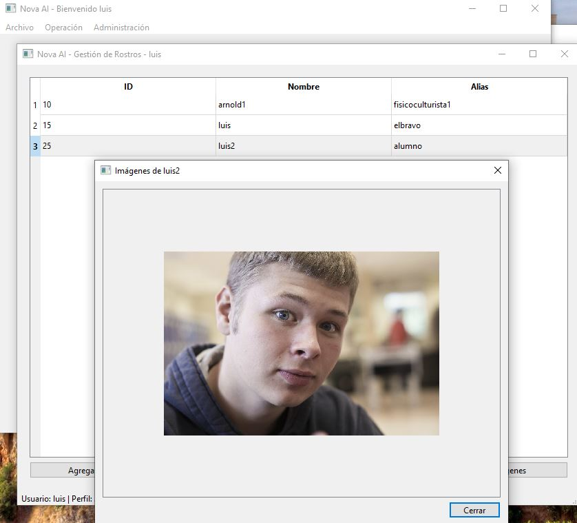
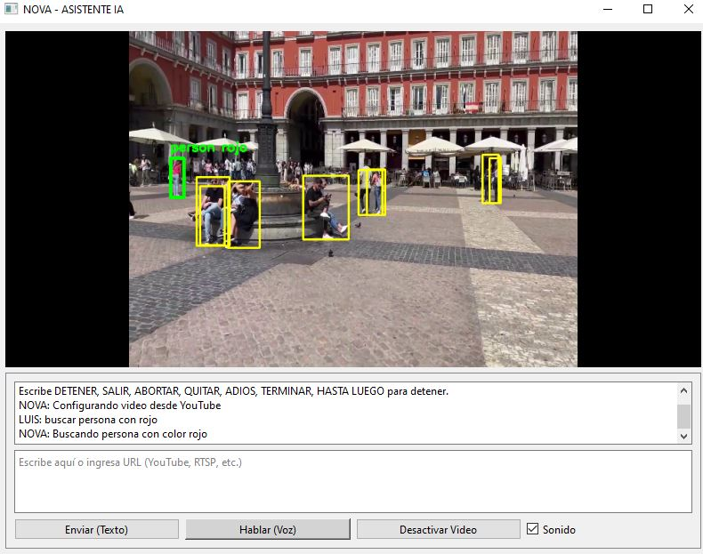
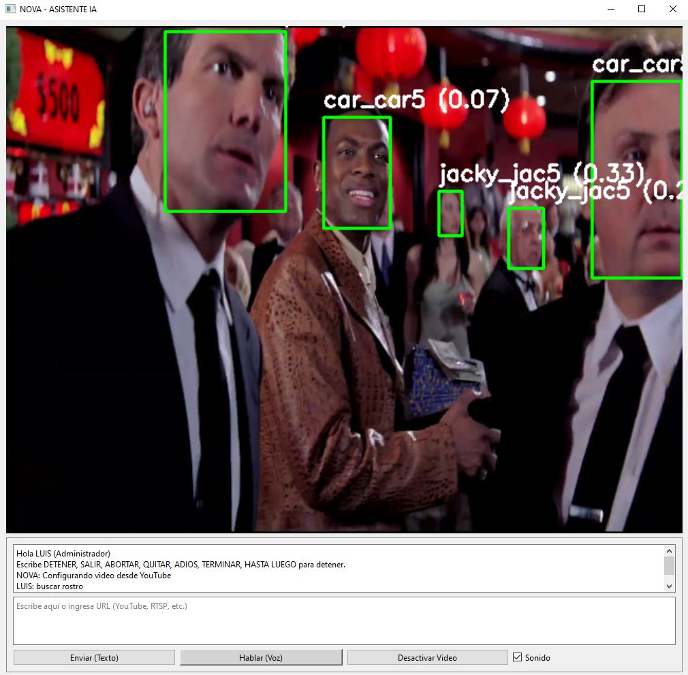
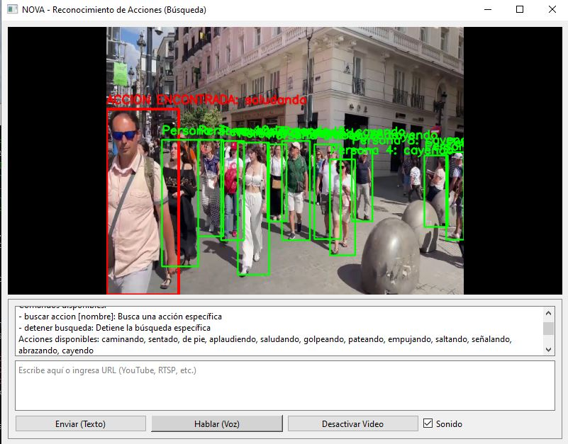

# Nova Desktop System

Sistema de escritorio con visión por computadora y LLMs

## Requisitos
- Python 3.12
- PostgreSQL
- Conda

## Instalación
```bash
conda env create -f environment.yml
conda activate nova-desktop
```

## Login del sistema


## Registro de Usuarios del sistema con perfil Administrador u Operador


## Registro de Rostro a Buscar


## Busqueda de Objeto


## Busqueda de Rostro


## Busqueda de Acción

